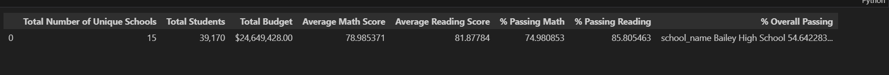
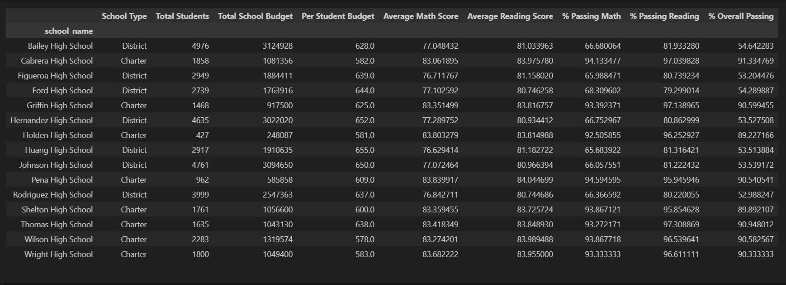

# Pandas Challenge:

# Description:

You are the new Chief Data Scientist for your city's school district. In this capacity, you'll be helping the school board and mayor make strategic decisions regarding future school budgets and priorities.

As a first task, you've been asked to analyze the district-wide standardized test results. You'll be given access to every student's math and reading scores, as well as various information on the schools they attend. Your task is to aggregate the data to showcase obvious trends in school performance.

Using Pandas and Jupyter Notebook, create a report that includes the following data. Your report must include a written description of at least two observable trends based on the data.

### District Summary
Perform the necessary calculations and then create a high-level snapshot of the district's key metrics in a DataFrame.

Include the following:

Total number of unique schools

Total students

Total budget

Average math score

Average reading score

% passing math (the percentage of students who passed math)

% passing reading (the percentage of students who passed reading)

% overall passing (the percentage of students who passed math AND reading)

### School Summary
Perform the necessary calculations and then create a DataFrame that summarizes key metrics about each school.

Include the following:

School name

School type

Total students

Total school budget

Per student budget

Average math score

Average reading score

% passing math (the percentage of students who passed math)

% passing reading (the percentage of students who passed reading)

% overall passing (the percentage of students who passed math AND reading)

# Technology Used: 
Jupyter
Python
# Screenshots!!

**Done!  congratulations**

